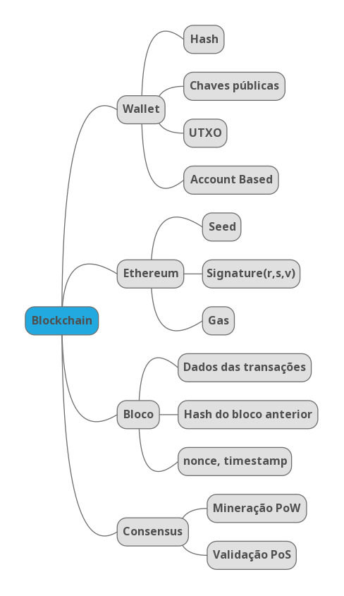

[< back](../README.md)
# MÓDULO 2 - AULA 1 
Essa aula foi ministrada pelo instrutor [Lucas Oliveira](https://www.linkedin.com/in/olivmath/), esta diponivel no [Youtube](https://www.youtube.com/watch?v=yModQgXgCdI) ou através da [plataforma da NearX](https://app.nearx.com.br/course/module/51?courseid=14&moduleid=51&lessonid=350&order=1).

## 1. WALLET

### 1.1 Funções de Hash 
Funções de hash desempenham um papel crucial na tecnologia blockchain. São algoritmos matemáticos que recebem uma entrada (ou 'mensagem') e retornam uma sequência de bytes de tamanho fixo. O resultado, tipicamente um 'resumo', é único para cada entrada única. Funções de hash são determinísticas, o que significa que a mesma entrada sempre produzirá o mesmo resultado.

Exemplo: 

| Entrada | Retorno [sha256](https://tools.superdatascience.com/blockchain/hash/) |
| :--- | :-- | 
|nearx | 0d1977447634f5f09d1437ae6374fca5266fccd4312c0b08f2c7ba29f79ee374|
| Nearx | 44e1c222a49649d979423f809b6352d5de2c468f2d9f403a3372199d1b8f4630 |

### 1.2 Chaves Públicas

O Conceito de Chaves Públicas e Privadas, refere-se ao conceito de Criptografia assimétrica.
A Chave PRIVADA **NUNCA**, em **NENHUMA Hipótese**, deve ser revelada.
Com ela você deriva a chave PÚBLICA, e essa sim, é revelada.

Seguindo o desenho em anexo, imagine que Alice e Bob precisam trocar uma mensagem, e somente os 2 sabe seu conteúdo.

Alice envia sua chave pública para o BOB e ele criptografa a informação com a chave publica dele e da Alice.
Alice recebe a mensagem, e consegue recuperar seu conteúdo, abrindo com sua chave **PRIVADA**.

### 1.3 UTXO

UTXO é um protocolo utilizado, principalmente em redes Bitcoin.
O Conceito é de um Token Único, e caso você queira fracioná-lo, você envia para o destinatário o valor fracionado, e recebe o "troco" em sua própria carteira, com a diferença entre o valor fracionado e as despesas da transação.

### 1.4 Account-Based

Account-Based é um conceito usado principalmente em redes Ethereum Alike.
O Conceito é muito mais simples de entender, pois ele debita os valores de envio e despesas de transações baseados no saldo total de sua conta.

## 2. Transações

### Ciclo de vida de uma Tx

O Ciclo de vida de uma transação, dependerá da tecnologia blockchain.
No Caso de uma rede Bitcoin por exemplo, a transação só é efetivada, quando sua transação é transmitida e uma determinada quantidade de mineradodes (6 em uma rede de testes por exemplo), confirmam esta transação.
Em uma Rede Ethereum alike, dependerá do protocolo de consenso utilizado, não existe o conceito de mineração, mas sim, de validação dos blocos, que pode ser por votação dos nós (POA - Proof of Authority), Seleção aleatória de validadores, (Proof of Stake, neste caso, nós com maiores valores em carteira tem mais chances de serem selecionados) entre outros.

### Taxas

As taxas são valores pagos aos mantenedores das redes blockchain.
Tendo em mente que a rede Blockchain é um grande banco de dados, que necessita de infraestrutura, pessoas, energia e uma série de custos envolvidos, toda transação enviada para ser gravada na blockchain, o emissor paga as taxas de transmissão. em uma rede Ethereum alike, esta taxa é conhecida como *GAS*. As taxas variam de acordo com a rede, regras, utilização, tipo de informação a ser salva, tráfego no momento da solicitação entre outras variáveis.

## 3. Blocos

### Criando uma Blockchain

Para criação de um bloco, o nó princial necessita informar e criar o Genesis block, e dentro dele ele possui o início das transações e suas regras, bem como o status inicial e seu hash inicial.

### Merkle Tree

Merkle Tree, nada mais é que uma estrutura de dados que otimiza hashes em uma estrutura de árvore. Ela agrupa 2 ou mais blocos de informação, fazendo com que eu chegue até a raíz, ou genesis block de uma forma muito mais rápida e eficiente, evitando calcular todo o caminho de dados gerados em um bloco. Isso dá escalabilidade em todo o processo.

## 4. Consenso

### Proof-of-Work

Usado normalmente em redes Biticoin, é o conceito de mineiração.
Basicamente é a solução do desafio de encontrar uma sequencia de "0's" para criar o hash válido. Este processo consome muita energia, leva muito mais tempo, porém é muito mais seguro e virtualmente impossível de ser atacado ou economicamente inviável criar uma estrutura de ataque à rede.

### Proof-of-Stake

Consiste basicamente em fazer um sorteio aleatório dos nós participantes da rede, remunerando-os a cada bloco validado. Nós com maior volume armazenado em sua carteira terão mais chaces de serem selecionados.

### Proof-of-Authority

Normalmente utilizados em blockchains permissionadas com uma empresa ou entidade centralizadora. Ela será responsável por criar a cadeia de confiança entre os nós, e todos os blocos validados seguem as regras pelo órgão centralizador.

### Mapa mental
