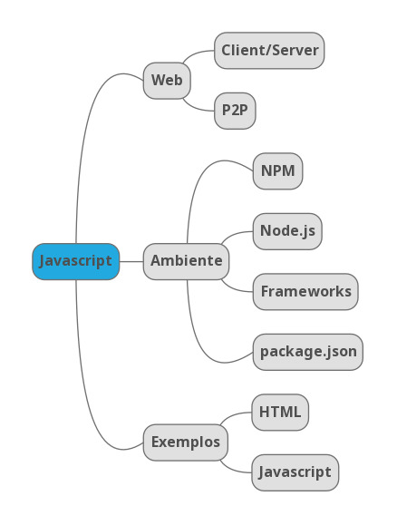

[< back](../README.md)
# RESUMO AULA 2 BOOTCAMP - NEARX - FEV/2024

📦 Instalar node: [Instalação Node.js](https://nodejs.org/en/download/package-manager#debian-and-ubuntu-based-linux-distributions)

🖥️ Instalar vscode: [Instalação VSCode](https://code.visualstudio.com/download)

📦 Instalar npm: `$ sudo apt install npm`
 
## Tipos de dados

🔢 Numbers:

```
// Declaração de variáveis numéricas
let numeroInteiro = 10;
let numeroDecimal = 3.14;
let numeroGrande = 1234567890123456789012345678901234567890n;
let naoENumero = NaN;
let infinitoPositivo = Infinity;
let infinitoNegativo = -Infinity;

```

📝 String:

```
let stringComAspasDuplas = "Isso é uma string com aspas duplas.";
let stringComAspasSimples = 'Isso é uma string com aspas simples.';

let nome = "Alice";
let idade = 30;
let templateLiteral = `Meu nome é ${nome} e tenho ${idade} anos.`;

let stringBruta = String.raw`Caminho do arquivo: C:\meuarquivo\nome.txt`;

let stringObjeto = new String("Isso é uma string usando o objeto String.");
```

✅/❌ Boolean:

```
let estaChovendo = true;
let solBrilhando = false;
```

🚫 Undefined: 

```
let variavelIndefinida;
console.log(variavelIndefinida); // Output: undefined

console.log(variavelNaoDeclarada); // Output: Uncaught ReferenceError: variavelNaoDeclarada is not defined


```

0️⃣ Null: 

```
let variavelNula = null;
console.log(variavelNula); // Output: null

```

🗃️ Array: 

```
let meuArray = [];

let numeros = [1, 2, 3, 4, 5];
let frutas = ["maçã", "banana", "laranja"];
console.log(numeros[0]); // Output: 1
console.log(frutas[1]); // Output: "banana"

frutas[1] = "morango";
console.log(frutas); // Output: ["maçã", "morango", "laranja"]

frutas.push("uva");
console.log(frutas); // Output: ["maçã", "morango", "laranja", "uva"]

frutas.pop();
console.log(frutas); // Output: ["maçã", "morango", "laranja"]

console.log(frutas.length); // Output: 3
```

🛠️ Object: 
```
let pessoa = {};

let pessoa = {
    nome: "João",
    idade: 30,
    cidade: "São Paulo"
};

console.log(pessoa.nome); // Output: "João"
console.log(pessoa.idade); // Output: 30
console.log(pessoa.cidade); // Output: "São Paulo"


pessoa.idade = 31;
console.log(pessoa.idade); // Output: 31

pessoa.profissao = "Engenheiro";
console.log(pessoa.profissao); // Output: "Engenheiro"

delete pessoa.cidade;
console.log(pessoa); // Output: { nome: "João", idade: 31, profissao: "Engenheiro" }

console.log("profissao" in pessoa); // Output: true
console.log("cidade" in pessoa); // Output: false


```

## Operadores

➕➖✖️➗ Aritmética:
```
// Declaração de variáveis
let numero1 = 10;
let numero2 = 5;

// Operações aritméticas
let soma = numero1 + numero2;
let subtracao = numero1 - numero2;
let multiplicacao = numero1 * numero2;
let divisao = numero1 / numero2;
let resto = numero1 % numero2; // Resto da divisão

// Exibição dos resultados
console.log("Soma:", soma); // Output: 15
console.log("Subtração:", subtracao); // Output: 5
console.log("Multiplicação:", multiplicacao); // Output: 50
console.log("Divisão:", divisao); // Output: 2
console.log("Resto:", resto); // Output: 0

```


🆚 Comparação:

```
let x = 10;
let y = 5;

// Comparação de igualdade
console.log("x é igual a y?", x === y); // Output: false

// Comparação de desigualdade
console.log("x é diferente de y?", x !== y); // Output: true

// Comparação de maior que
console.log("x é maior que y?", x > y); // Output: true

// Comparação de menor que
console.log("x é menor que y?", x < y); // Output: false

// Comparação de maior ou igual a
console.log("x é maior ou igual a y?", x >= y); // Output: true

// Comparação de menor ou igual a
console.log("x é menor ou igual a y?", x <= y); // Output: false


```

🧠 Lógicos: 

```
let x = 10;
let y = 5;

// Comparação de igualdade
console.log("x é igual a y?", x === y); // Output: false

// Comparação de desigualdade
console.log("x é diferente de y?", x !== y); // Output: true

// Comparação de maior que
console.log("x é maior que y?", x > y); // Output: true

// Comparação de menor que
console.log("x é menor que y?", x < y); // Output: false

// Comparação de maior ou igual a
console.log("x é maior ou igual a y?", x >= y); // Output: true

// Comparação de menor ou igual a
console.log("x é menor ou igual a y?", x <= y); // Output: false

```

## Controle de Fluxo

🚦 if, else, switch:
```
let idade = 18;

if (idade < 18) {
    console.log("Você é menor de idade.");
} else if (idade >= 18 && idade < 65) {
    console.log("Você é um adulto.");
} else {
    console.log("Você é um idoso.");
}

let diaDaSemana = 5;
let nomeDoDia;

switch (diaDaSemana) {
  case 1:
    nomeDoDia = "Segunda-feira";
    break;
  case 2:
    nomeDoDia = "Terça-feira";
    break;
  case 3:
    nomeDoDia = "Quarta-feira";
    break;
  case 4:
    nomeDoDia = "Quinta-feira";
    break;
  case 5:
    nomeDoDia = "Sexta-feira";
    break;
  case 6:
    nomeDoDia = "Sábado";
    break;
  case 7:
    nomeDoDia = "Domingo";
    break;
  default:
    nomeDoDia = "Dia inválido";
    break;
}

console.log("O dia", diaDaSemana, "corresponde a:", nomeDoDia);

```

♾️ while, do...while: 

```
let contador = 0;

while (contador < 5) {
    console.log("Contagem:", contador);
    contador++;
}


let contador = 0;

do {
    console.log("Contagem:", contador);
    contador++;
} while (contador < 5);

```

🔄 for, for...of, for...in:

```
for (let i = 0; i < 5; i++) {
    console.log("Iteração:", i);
}


let numeros = [1, 2, 3, 4, 5];

for (let numero of numeros) {
    console.log("Número:", numero);
}


let pessoa = {
    nome: "João",
    idade: 30,
    cidade: "São Paulo"
};

for (let chave in pessoa) {
    console.log(chave + ":", pessoa[chave]);
}

```


## Dados (Functional Programming)

🗂️ Array: 

```
// Função impura
let valor = 10;
function adicionar(x) {
    return x + valor;
}

console.log(adicionar(5)); // Output: 15

valor = 20; // Modificação do estado externo

console.log(adicionar(5)); // Output: 25 (resultado diferente)

// Função pura equivalente
function adicionarPuro(x, y) {
    return x + y;
}

console.log(adicionarPuro(5, 10)); // Output: 15
```

🗃️ Object: 

```
// Função para converter a primeira letra de uma string em maiúscula
function primeiraLetraMaiuscula(str) {
  return str.charAt(0).toUpperCase() + str.slice(1);
}

// Função para formatar uma pessoa em uma string
function formatarPessoa(pessoa) {
  return `${primeiraLetraMaiuscula(pessoa.nome)}, ${pessoa.idade} anos`;
}

const pessoa = { nome: "joão", idade: 30 };
console.log(formatarPessoa(pessoa)); // João, 30 anos

```
 ### Mapa mental
