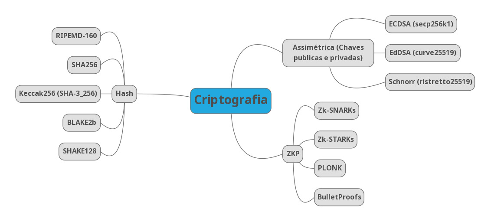

[< back](../README.md)
# RESUMO AULA 3 BOOTCAMP - NEARX - FEV/2024

## Hashing

## RIPEMD-160

🔑 RIPEMD-160: O RIPEMD-160 é uma função de hash criptográfica que produz um resumo de 160 bits (20 bytes) de uma entrada de dados, sendo amplamente usado em segurança de dados e criptografia. Ele é semelhante ao SHA-1 em termos de tamanho de saída e finalidade, mas utiliza uma abordagem diferente, sendo desenvolvido inicialmente na Europa como uma alternativa de código aberto ao algoritmo SHA.

## SHA256

🔑 SHA256: O algoritmo SHA-256 (Secure Hash Algorithm 256 bits) é um dos membros da família de algoritmos SHA-2, projetado para produzir um resumo criptográfico de 256 bits (ou 32 bytes) de uma entrada de dados. O processo básico do SHA-256 envolve as seguintes etapas:

1. **Padding:** A entrada é preenchida com bits adicionais para alcançar um comprimento específico compatível com o algoritmo.

1. **Divisão em Blocos:** A entrada é dividida em blocos de 512 bits (64 bytes) cada.

1. **Inicialização do Estado:** Um conjunto inicial de valores constantes, conhecido como "state", é definido. Estes valores iniciais representam uma série de raízes quadradas de números primos.

1. **Processamento dos Blocos:** Cada bloco de mensagem é processado em uma série de iterações que envolvem operações bitwise, adições modulares e rotações.

1. **Mistura dos Blocos:** O estado atual e o bloco de mensagem são misturados repetidamente através de uma série de operações, resultando em uma transformação do estado.

1. **Geração do Hash Final:** Após processar todos os blocos, o estado final é convertido em uma representação de hash de 256 bits.

O SHA-256 é projetado para ser resistente a ataques criptográficos, como pré-imagem, colisão e ataque diferencial. É amplamente utilizado em sistemas de segurança digital para verificar a integridade de dados, assinar digitalmente documentos e proteger senhas.

## Keccak256

🔑 Kekcack256 O algoritmo Keccak256 é uma função de hash criptográfica que produz um resumo de 256 bits (ou 32 bytes) de uma entrada de dados. Ele pertence à família de algoritmos Keccak, que foi escolhido como o vencedor do concurso do Instituto Nacional de Padrões e Tecnologia (NIST) para o Padrão de Hash de Função Criptográfica (FIPS) SHA-3.

O processo básico do Keccak256 envolve as seguintes etapas:

1. **Padding:** A entrada é preenchida com bits adicionais para alcançar um comprimento específico compatível com o algoritmo.

1. **Divisão em Blocos:** A entrada é dividida em blocos de dados de tamanho adequado.

1. **Inicialização do Estado:** Um estado interno é inicializado com um valor inicial definido pelo algoritmo.

1. **Absorção e Mistura:** Os blocos de entrada são absorvidos pelo estado interno, onde ocorrem operações de mistura e permutação.

1. **Espremer:** O estado interno é então espremido para produzir o hash final de 256 bits.

O Keccak256 é altamente seguro e resistente a diversos tipos de ataques criptográficos, como pré-imagem, colisão e extensão de comprimento. É amplamente utilizado em criptomoedas, blockchain e outras aplicações de segurança digital.

## BLAKE2b

🔑 BLAKE2b: O algoritmo BLAKE2b é uma função de hash criptográfico de alta performance que produz um resumo de tamanho variável a partir de uma entrada de dados. Ele é uma variante do BLAKE2, projetado especificamente para arquiteturas de 64 bits e é uma das escolhas populares em criptografia moderna devido à sua eficiência e segurança.

As principais características do BLAKE2b incluem:

1. **Eficiência:** O BLAKE2b é otimizado para processadores de 64 bits, aproveitando suas características de arquitetura para obter alto desempenho.

1. **Segurança:** O algoritmo foi projetado com uma ampla margem de segurança, resistindo a uma variedade de ataques criptográficos conhecidos.

1. **Flexibilidade de Tamanho de Saída:** O BLAKE2b permite que o usuário especifique o tamanho do resumo desejado, o que o torna útil em diversas aplicações.

1. **Simplicidade e Versatilidade:** O algoritmo é relativamente simples em comparação com alguns de seus concorrentes, o que o torna fácil de implementar e usar em uma variedade de contextos.

## SHAKE3

🔑 SHAKE3: O algoritmo SHAKE3 é uma variante da família de funções de hash SHA-3, que foi escolhida pelo Instituto Nacional de Padrões e Tecnologia (NIST) como um novo padrão de hash criptográfico. O SHAKE3 é uma versão mais recente do SHAKE (Secure Hash Algorithm and KECCAK) que oferece capacidade de hash de tamanho variável.

Principais características do SHAKE3:

1. **Tamanho Variável de Saída:** O SHAKE3 permite gerar resumos hash de tamanho variável, o que significa que você pode especificar o tamanho desejado do hash ao usá-lo.

1. **Baseado na Estrutura do KECCAK:** Assim como o SHA-3, o SHAKE3 é baseado na estrutura do algoritmo KECCAK, que utiliza uma construção esponja.

1. **Resistência a Ataques Criptográficos:** O SHAKE3 é projetado para ser altamente resistente a uma variedade de ataques criptográficos, incluindo colisões, pré-imagem e ataques de extensão de comprimento.

1. **Alta Eficiência:** O SHAKE3 é otimizado para desempenho, tornando-o adequado para uma ampla gama de aplicações que exigem hashing eficiente.

---

## Criptografia Assimétrica

## 🔏 Curvas Elípticas

## ECDSA

🔑ECDSA (secp256k1): O algoritmo ECDSA (Elliptic Curve Digital Signature Algorithm) com a curva secp256k1 é uma implementação específica do ECDSA usando uma curva elíptica conhecida como secp256k1. Esta curva é definida sobre um corpo finito de ordem prima e é amplamente utilizada em criptografia de chave pública, especialmente em criptomoedas como o Bitcoin.

Aqui estão os principais pontos sobre o ECDSA com a curva secp256k1:

1. **Curva Eliptica secp256k1:** A curva secp256k1 é uma curva elíptica definida sobre um corpo finito de ordem prima, conhecido como um campo primo. Ela é especificamente projetada para ser utilizada em criptografia e é escolhida para sua eficiência e propriedades matemáticas.

1. **Geração de Chaves:** No ECDSA com a curva secp256k1, cada entidade gera um par de chaves: uma chave privada e uma chave pública. A chave privada é um número aleatório dentro de um intervalo específico, enquanto a chave pública é gerada multiplicando a chave privada pelo ponto base na curva.

1. **Assinatura Digital:** Para assinar uma mensagem, o remetente utiliza sua chave privada para calcular uma assinatura única para essa mensagem. Isso envolve uma série de cálculos matemáticos na curva elíptica. A assinatura resultante é composta por dois valores, chamados de r e s.

1. **Verificação da Assinatura:** O destinatário da mensagem utiliza a chave pública do remetente e os valores r e s da assinatura para verificar se a assinatura é válida. Isso também envolve cálculos na curva elíptica para garantir que a assinatura corresponda à mensagem e à chave pública do remetente.

1. **Aplicações:** O ECDSA com a curva secp256k1 é amplamente utilizado em criptomoedas, como o Bitcoin, onde é usado para assinar transações e provar a posse de bitcoins. Também é empregado em outros sistemas que requerem autenticação digital e integridade de dados.

A segurança do ECDSA com a curva secp256k1 depende da robustez da curva elíptica e da geração e armazenamento adequados das chaves privadas.

## EdDSA

🔑EdDSA (curve25519): O algoritmo EdDSA (Elliptic Curve Digital Signature Algorithm) com a curva curve25519 é um esquema de assinatura digital baseado em curvas elípticas. Ele oferece autenticação e integridade em comunicações digitais, semelhante ao ECDSA, mas com algumas diferenças significativas.

Aqui estão os principais pontos sobre o EdDSA com a curva curve25519:

1. **Curva Eliptica curve25519:** A curva curve25519 é uma curva elíptica amplamente utilizada em criptografia moderna, especificamente projetada para eficiência e segurança. Ela opera sobre um corpo finito de ordem prima e oferece propriedades matemáticas que garantem segurança criptográfica.

1. **Geração de Chaves:** Cada entidade gera um par de chaves: uma chave privada e uma chave pública. A chave privada é um número aleatório dentro de um intervalo específico, enquanto a chave pública é gerada multiplicando a chave privada por um ponto base fixo na curva.

1. **Assinatura Digital:** Para assinar uma mensagem, o remetente utiliza sua chave privada para calcular uma assinatura única para essa mensagem. Isso envolve uma série de cálculos matemáticos na curva curve25519. A assinatura resultante é uma combinação de pontos na curva.

1. **Verificação da Assinatura:** O destinatário da mensagem utiliza a chave pública do remetente e a assinatura para verificar se a assinatura é válida. Isso também envolve cálculos na curva curve25519 para garantir que a assinatura corresponda à mensagem e à chave pública do remetente.

1. **Eficiência e Segurança:** O EdDSA com a curva curve25519 é conhecido por sua eficiência computacional e segurança robusta. Ele oferece um nível elevado de segurança com um custo computacional relativamente baixo, o que o torna adequado para uma variedade de aplicações criptográficas.

## Schnorr

Schnorr (ristretto25519): O algoritmo de Schnorr é um esquema de assinatura digital desenvolvido por Claus Schnorr. Ele é conhecido por sua simplicidade, eficiência e segurança robusta. Aqui estão os principais pontos sobre o algoritmo de Schnorr:

1. **Geração de Chaves:** Assim como em outros esquemas de assinatura digital, no algoritmo de Schnorr, cada entidade gera um par de chaves: uma chave privada e uma chave pública. A chave privada é um número aleatório, enquanto a chave pública é derivada dela usando operações matemáticas específicas.

1. **Assinatura Digital:** Para assinar uma mensagem, o remetente utiliza sua chave privada para calcular uma assinatura única para essa mensagem. O cálculo da assinatura envolve operações matemáticas sobre a mensagem e a chave privada.

1. **Verificação da Assinatura:** O destinatário da mensagem utiliza a chave pública do remetente e a assinatura para verificar se a assinatura é válida. Isso também envolve operações matemáticas para garantir que a assinatura corresponda à mensagem e à chave pública do remetente.

1. **Eficiência:** O algoritmo de Schnorr é conhecido por sua eficiência computacional. Ele requer menos operações do que muitos outros esquemas de assinatura digital, o que o torna adequado para uso em sistemas com recursos limitados.

1. **Segurança:** O algoritmo de Schnorr é considerado seguro contra uma ampla gama de ataques criptográficos. Sua segurança é baseada na dificuldade de resolver problemas matemáticos difíceis, como o problema do logaritmo discreto.

1. **Aplicações:** O algoritmo de Schnorr é amplamente utilizado em sistemas criptográficos, incluindo criptomoedas, autenticação de mensagens, protocolos de segurança de rede e muito mais. Ele oferece uma combinação de segurança, eficiência e simplicidade que o torna uma escolha popular em muitos contextos.

O algoritmo de Schnorr é frequentemente considerado uma alternativa atraente a outros esquemas de assinatura digital, como o ECDSA (Elliptic Curve Digital Signature Algorithm), especialmente devido à sua simplicidade e segurança robusta.

---

## ZKP (Zero-Knowledge Proofs)

## Zk-SNARKs

🔍 Zk-SNARKs: Zk-SNARKs (Zero-Knowledge Succinct Non-Interactive Arguments of Knowledge) são um tipo de prova de conhecimento zero, um conceito em criptografia que permite a uma parte provar que possui uma informação sem revelar a própria informação em si. Os Zk-SNARKs são particularmente notáveis pela sua capacidade de permitir a verificação de informações sem revelar a própria informação ou qualquer detalhe sobre ela.

Aqui estão os principais pontos sobre os Zk-SNARKs:

1. **Provas de Conhecimento Zero:** Em uma prova de conhecimento zero, uma parte (o proponente) pode provar a validade de uma afirmação para outra parte (o verificador), sem revelar nenhum detalhe sobre a informação subjacente. Isso significa que o verificador pode confirmar a veracidade da afirmação sem aprender nada além disso.

1. **Succinct Non-Interactive:** Zk-SNARKs são "sucintos" porque as provas geradas são muito pequenas em comparação com a informação que elas representam. Isso significa que a verificação da prova é computacionalmente eficiente. Além disso, eles são "não interativos", o que significa que a prova pode ser gerada uma vez e verificada muitas vezes, sem a necessidade de interações adicionais entre o proponente e o verificador.

1. **Aplicações:** Zk-SNARKs têm uma ampla gama de aplicações em sistemas distribuídos, blockchain e privacidade. Por exemplo, eles são usados em criptomoedas como Zcash para permitir transações privadas sem revelar detalhes confidenciais. Também podem ser aplicados em sistemas de votação eletrônica, autenticação de identidade e muito mais.

1. **Construção Matemática Complexa:** A construção dos Zk-SNARKs envolve conceitos matemáticos avançados, como curvas elípticas, emparelhamentos criptográficos, grafos acíclicos direcionados (DAGs) e mais. As implementações reais desses sistemas geralmente exigem considerável expertise em criptografia e teoria da computação.

Os Zk-SNARKs representam um avanço significativo na capacidade de fornecer prova de conhecimento zero de forma eficiente e são uma ferramenta poderosa para garantir a privacidade e a segurança em uma variedade de aplicações de computação distribuída.

## ZK-STARKs

🔍 ZK-STARKs: ZK-STARKs (Zero-Knowledge Scalable Transparent Arguments of Knowledge) são uma classe de protocolos de prova de conhecimento zero baseados em arquiteturas transparentes e escaláveis. Eles são projetados para oferecer os benefícios de prova de conhecimento zero, ou seja, a capacidade de provar a validade de uma afirmação sem revelar detalhes confidenciais, de uma forma que seja escalável e transparente.

Aqui estão os principais pontos sobre os ZK-STARKs:

1. **Prova de Conhecimento Zero:** Como em outros protocolos de prova de conhecimento zero, os ZK-STARKs permitem que uma parte prove a validade de uma afirmação para outra parte sem revelar informações confidenciais ou qualquer detalhe sobre a informação subjacente.

1. **Escalabilidade:** Os ZK-STARKs são projetados para serem escaláveis, o que significa que podem ser eficientemente aplicados a grandes volumes de dados. Eles são adequados para situações em que a complexidade computacional das provas não cresce exponencialmente com o tamanho dos dados.

1. **Transparência:** Uma característica importante dos ZK-STARKs é a transparência. Isso significa que as provas geradas são facilmente verificáveis por qualquer pessoa, sem a necessidade de conhecimento especializado ou confiança em uma autoridade central. Isso promove a auditabilidade e a confiança no sistema.

1. **Construção Baseada em Polinômios:** Os ZK-STARKs são construídos com base em polinômios e técnicas de interpolação. Eles aproveitam propriedades matemáticas desses polinômios para gerar provas que podem ser verificadas de forma eficiente, sem revelar qualquer informação sensível.

1. **Aplicações:** ZK-STARKs têm uma ampla gama de aplicações, incluindo criptomoedas, sistemas de votação eletrônica, blockchain, autenticação de dados e muito mais. Sua capacidade de oferecer provas escaláveis e transparentes os torna úteis em muitos cenários de computação distribuída e segurança.

Os ZK-STARKs representam uma abordagem inovadora para a prova de conhecimento zero, oferecendo escalabilidade e transparência que podem ser valiosas em uma variedade de aplicações. Eles continuam a ser uma área ativa de pesquisa e desenvolvimento na criptografia moderna.

## PLONK

🔍 PLONK: PLONK (Permutation Argument for Linear configurations Over Nuisance arithmetics with Knowledge) é um protocolo de prova de conhecimento zero altamente eficiente e universalmente aplicável. Ele é projetado para permitir a prova de declarações sobre cálculos em uma ampla variedade de cenários, incluindo computações baseadas em circuitos, grafos de autômatos, cálculos de álgebra linear e muito mais.

Aqui estão os principais pontos sobre o PLONK:

1. **Eficiência:** Uma das principais características do PLONK é sua eficiência. Ele foi projetado para gerar e verificar provas de conhecimento zero de forma rápida e escalável, mesmo para computações complexas e grandes conjuntos de dados.

1. **Universalidade:** O PLONK é universalmente aplicável, o que significa que pode ser usado para provar uma ampla variedade de declarações sobre cálculos. Isso inclui declarações sobre circuitos aritméticos, circuitos booleanos, cálculos de álgebra linear e muito mais.

1. **Segurança:** O PLONK oferece segurança forte, garantindo que as provas geradas sejam válidas e que os verificadores possam confiar nelas. Ele foi projetado com cuidado para resistir a uma variedade de ataques criptográficos.

1. **Flexibilidade:** O PLONK é altamente flexível e pode ser adaptado para atender às necessidades específicas de diferentes aplicações e contextos. Ele suporta uma variedade de configurações e parâmetros que podem ser ajustados conforme necessário.

1. **Implementações:** O PLONK já foi implementado em várias bibliotecas de criptografia e é utilizado em várias plataformas e sistemas, incluindo blockchain, sistemas de votação eletrônica, sistemas de autenticação de dados e muito mais.

Em resumo, o PLONK é um protocolo poderoso e versátil de prova de conhecimento zero que oferece eficiência, segurança e universalidade. Ele tem o potencial de ter um impacto significativo em uma ampla gama de aplicações que exigem provas criptográficas robustas e eficientes.

## BulletProofs

🔍 BulletProofs: O Bulletproofs é um protocolo de prova de conhecimento zero projetado para ser eficiente e escalável, especialmente em contextos onde a privacidade e a confidencialidade são importantes, como em criptomoedas baseadas em blockchain. Aqui estão os principais pontos sobre o algoritmo Bulletproofs:

1. **Prova de Conhecimento Zero:** Como outros protocolos desse tipo, o Bulletproofs permite a prova de que uma afirmação é verdadeira sem revelar qualquer informação adicional sobre ela, exceto sua veracidade. Isso permite a verificação de transações ou declarações em um blockchain sem revelar os detalhes específicos, garantindo privacidade.

1. **Compacto e Eficiente:** Uma característica proeminente dos Bulletproofs é sua eficiência. Eles geram provas de tamanho muito pequeno em comparação com outros métodos, tornando-os adequados para uso em blockchain e outras aplicações onde o espaço é um recurso valioso. Isso também contribui para a redução do tempo de verificação.

1. **Escalabilidade:** O Bulletproofs é altamente escalável, o que significa que o tempo de verificação e o espaço necessário para armazenamento de provas crescem de forma muito mais lenta do que o tamanho da declaração sendo provada. Isso é crucial para a implementação em blockchain, onde a escalabilidade é uma preocupação chave.

1. **Segurança:** Os Bulletproofs foram projetados para serem seguros contra uma variedade de ataques criptográficos. Eles são baseados em pressupostos criptográficos sólidos e bem estudados.

1. **Aplicações:** Os Bulletproofs têm uma variedade de aplicações, sendo mais notavelmente utilizados em criptomoedas como o Bitcoin e o Monero. Eles são usados para provar a validade de transações sem revelar informações sensíveis, como os valores transferidos ou os endereços dos remetentes e destinatários.

Em resumo, o Bulletproofs é um protocolo de prova de conhecimento zero altamente eficiente e escalável, com aplicações significativas em criptografia, especialmente em criptomoedas e sistemas baseados em blockchain. Ele oferece um equilíbrio entre privacidade, eficiência e segurança, tornando-o uma ferramenta valiosa em muitos contextos de segurança digital.

 ### Mapa mental
