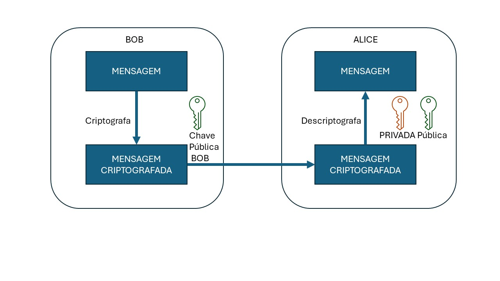
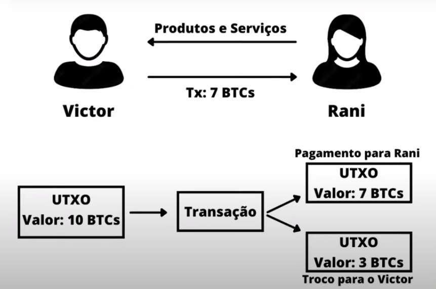

# AULA 1 
Essa aula foi ministrada pelo instrutor [Lucas Oliveira](https://www.linkedin.com/in/olivmath/), esta diponivel no [Youtube](https://www.youtube.com/watch?v=yModQgXgCdI) ou através da [plataforma da NearX](https://app.nearx.com.br/course/module/51?courseid=14&moduleid=51&lessonid=350&order=1), os exemplos de código apresentados durante a aula estão disponiveis no direterório [/week1/day1](../../week1/day1/README.md), também deixei as instruções para iniciar o ambiente no diretório [/notes/modulos/mod02/aul01](../modulos/mod02/aula01/README.md).

## 1. WALLET
No contexto da criptomoeda e do blockchain, uma carteira é uma ferramenta digital que permite aos usuários armazenar, enviar e receber moedas digitais como Bitcoin, Ethereum, etc. As carteiras podem ser baseadas em software (online, desktop ou móvel) ou em hardware-based (dispositivos físicos).

### 1.1 Funções de Hash 
Funções de hash desempenham um papel crucial na tecnologia blockchain. São algoritmos matemáticos que recebem uma entrada (ou 'mensagem') e retornam uma sequência de bytes de tamanho fixo. O resultado, tipicamente um 'resumo', é único para cada entrada única. Funções de hash são determinísticas, o que significa que a mesma entrada sempre produzirá o mesmo resultado.

Exemplo: 

| Entrada | Retorno [sha256](https://tools.superdatascience.com/blockchain/hash/) |
| :--- | :-- | 
|nearx | 0d1977447634f5f09d1437ae6374fca5266fccd4312c0b08f2c7ba29f79ee374|
| Nearx | 44e1c222a49649d979423f809b6352d5de2c468f2d9f403a3372199d1b8f4630 |

### 1.2 Chaves Públicas e Privada
O conceito de chaves públicas e privadas, refere-se ao conceito de criptografia assimétrica.
A Chave privada **NUNCA**, em **NENHUMA Hipótese**, deve ser revelada.
Com ela você deriva a chave PÚBLICA, e essa sim, é revelada.

Seguindo o desenho em anexo, imagine que Alice e Bob precisam trocar uma mensagem, e somente os 2 sabe seu conteúdo.

Alice envia sua chave pública para o BOB e ele criptografa a informação com a chave publica dele e da Alice.
Alice recebe a mensagem, e consegue recuperar seu conteúdo, abrindo com sua chave **PRIVADA**.

### 1.3 UTXO
UTXO é um protocolo utilizado, principalmente em redes Bitcoin.
O Conceito é de um Token Único, e caso você queira fracioná-lo, você envia para o destinatário o valor fracionado, e recebe o "troco" em sua própria carteira, com a diferença entre o valor fracionado e as despesas da transação.

### 1.4 Account-Based
Account-Based é um conceito usado principalmente em redes Ethereum Alike.
O Conceito é muito mais simples de entender, pois ele debita os valores de envio e despesas de transações baseados no saldo total de sua conta.

## 2. Transações
Uma transação é basicamente um registro de transferência de valor entre partes dentro da rede de uma blockchain.

### 2.1 **Remetente (From)**
A parte que envia o valor. Em uma blockchain, o remetente é identificado pelo endereço de sua carteira digital.

### 2.2 **Destinatário (To)**
A parte que recebe o valor. Assim como o remetente, o destinatário é identificado por um endereço de carteira.

### 2.3 **Valor (Value)**
A quantidade de criptomoeda ou valor digital sendo transferido na transação.

### 2.4 **Taxas (Fees)**
A maioria das blockchains cobra uma taxa para processar e registrar transações. Essas taxas incentivam os mineradores ou validadores a incluir a transação em um bloco. A taxa pode variar dependendo da complexidade da transação e da congestionamento da rede.

### 2.5 **Assinatura Digital (Digital Signature)**
Uma prova criptográfica que o remetente autorizou a transação. A assinatura digital é gerada a partir da chave privada do remetente e pode ser verificada por qualquer um na rede usando a chave pública correspondente do remetente.

### 2.6 **Dados de Entrada (Input Data)**
Em transações mais complexas, como aquelas em blockchains que suportam contratos inteligentes (por exemplo, Ethereum), pode haver dados adicionais incluídos para especificar a operação do contrato inteligente ou outros metadados.

### 2.7 **Registro de Transações**
Cada transação que envolve seu endereço de carteira é registrada na blockchain. Isso inclui transações onde você recebeu criptomoedas e transações onde você as enviou.

## 3. Cadeia de Blocos
A estrutura é composta por uma sequência encadeada de blocos, onde cada bloco contém um conjunto de transações. Cada bloco é vinculado ao anterior por meio de um código hash, formando uma cadeia.

### 3.1 Criando uma Blockchain
Para criação de um bloco, o nó princial necessita informar e criar o Genesis block, e dentro dele ele possui o início das transações e suas regras, bem como o status inicial e seu hash inicial, todos os outros blocos seguem a cadeia através do hash e parenthash que devem seguir a ordem.

### 3.2 Merkle Tree
Merkle Tree, nada mais é que uma estrutura de dados que otimiza hashes em uma estrutura de árvore. Ela agrupa 2 ou mais blocos de informação, fazendo com que eu chegue até a raíz, ou genesis block de uma forma muito mais rápida e eficiente, evitando calcular todo o caminho de dados gerados em um bloco. Isso dá escalabilidade em todo o processo. 

## 4. Consenso
O objetivo do consenso é garantir que todos os participantes da rede concordem sobre as transações válidas e a ordem em que são adicionadas à blockchain.

### 4.1 Proof-of-Work
Usado normalmente em redes Biticoin, é o conceito de mineiração.
Basicamente é a solução do desafio de encontrar uma sequencia de "0's" para criar o hash válido. Este processo consome muita energia, leva muito mais tempo, porém é muito mais seguro e virtualmente impossível de ser atacado ou economicamente inviável criar uma estrutura de ataque à rede.

### 4.2 Proof-of-Stake
Consiste basicamente em fazer um sorteio aleatório dos nós participantes da rede, remunerando-os a cada bloco validado. Nós com maior volume armazenado em sua carteira terão mais chaces de serem selecionados.

### 4.3 Proof-of-Authority
Normalmente utilizados em blockchains permissionadas com uma empresa ou entidade centralizadora. Ela será responsável por criar a cadeia de confiança entre os nós, e todos os blocos validados seguem as regras pelo órgão centralizador.